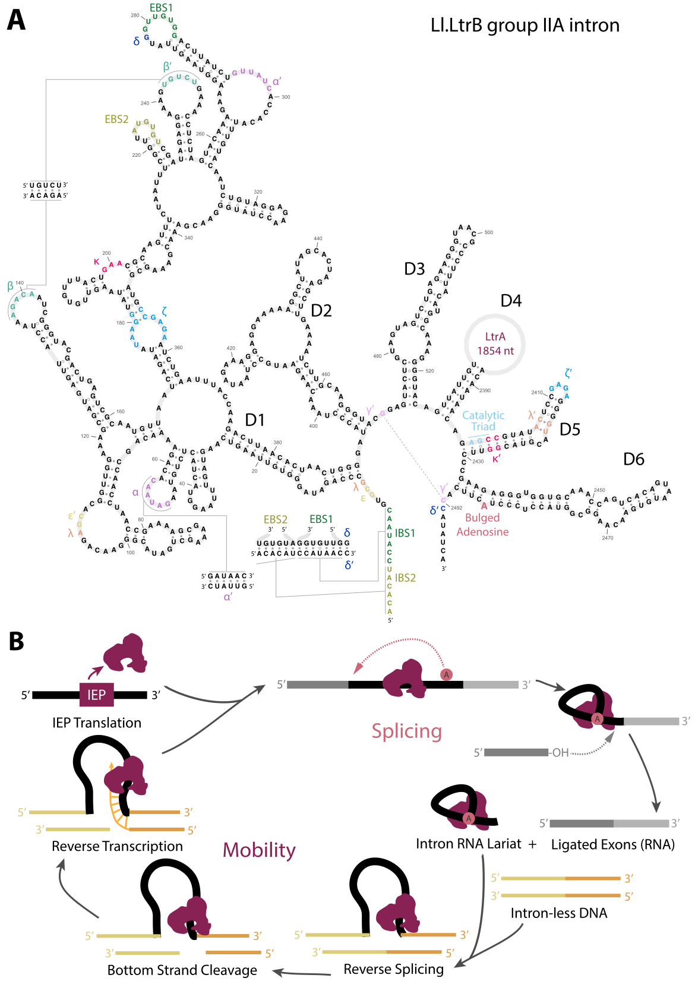

# 2025 Phage Group II Introns

## About
Code corresponing to the paper:

> [**Group II Introns in Phage Genomes** (2025)]()
> 
> Liana Merk, Sean Eddy

## Table of Contents
- [Genomes](#genomes)
- [Figure 1](#figure-1)
- [Figure 2](#figure-2)
- [Figure 3](#figure-3)
- [Figure 4](#figure-4)
- [Figure 5](#figure-5)
- [Figure 6](#figure-6)

- [How to replicate these figures](#how-to-replicate-these-figures)

---

# Genomes

- [Inphared perl script](https://github.com/RyanCook94/inphared/blob/main/inphared.pl)was used in  December 2023, Millard Lab, but genomes from this version are available from the [Millard lab website](http://millardlab.org/bacteriophage-genomics/phage-genomes-dec-2023/).
- [IMG/VR database v4.1 ](https://genome.jgi.doe.gov/portal/IMG_VR/IMG_VR.home.html)

---

## Figure 1



Group II intron depicted is BUCT083 prediction by [viennaRNA](http://rna.tbi.univie.ac.at/cgi-bin/RNAWebSuite/RNAfold.cgi), then traced in Illustrator. Remaining portions of the figure made in Illustrator.

## Figure 2


[Matplotlib python script]("./viz/fig2/matplotlib_clusters.py") to create base of subtype tree, later modified in Illustrator.

To assign subtypes, a mixture of secondary structure prediction and sequence similarity was used. The secondary structure prediction was done by [viennaRNA](http://rna.tbi.univie.ac.at/cgi-bin/RNAWebSuite/RNAfold.cgi) and key structural components were verified by eye. Sequence similarity was done by [nhmmer].

``` bash
cmsearch -o g2_intron_IB.out -A g2_intron_IB.aout --tblout g2_intron_IB.tblout --verbose -E 10 --cpu 64 /n/eddy_lab/users/lmerk/infernal_builds/g2_introns.cm ./IB.fna 
```


## Figure 3


Secondary structure prediction of [MN270259 intron](./viz/fig3/MN270259.txt) by [viennaRNA](http://rna.tbi.univie.ac.at/cgi-bin/RNAWebSuite/RNAfold.cgi), then modified in [RNAcanvas](https://rna2drawer.app/).

## Figure 4


### 4a RVT tree

Follow the protocol listed in 00README.txt.

## Figure 5


### 5a Polymerase map
- **Code**
    - In an environment with `lovis4u` installed, run the following command:
      ``` bash
      lovis4u -gb seqs -llp left -snl -mmseqs-off -c A4p2
      ```
    Note lovis4u will plot coordinates of tRNA features, so a genbank feature with the intron bounds was added to each genbank file, but is saved as a 'tRNA' feature.

- **Data**
    - Genomes used (`genbank` files with introns added)
      - Bacillus phage vB_BpuM-BpSp [`KT895374.gb`](viz/fig5/fig5a_newpolymerase/seqs/KT895374.gb)
      - Staphylococcus phage MarsHill [`MW248466.gb`](viz/fig5/fig5a_newpolymerase/seqs/MW248466.gb)
      - Bacillus phage vB_BspM_Internexus [`MW749003.gb`](viz/fig5/fig5a_newpolymerase/seqs/MW749003.gb)
      - Bacillus phage AR9 [`NC_031039.gb`](viz/fig5/fig5a_newpolymerase/seqs/NC_031039.gb)

### 5b Host Transfer
- **Code**
    - In an environment with `lovis4u` installed, run the following command:
      ``` bash
      lovis4u -gb seqs -llp left -snl
      ```
  This maintains the surrounding gene labels and performs similarity search with mmseqs.

- **Data**
    - Genomes used (`genbank` files with introns added)
        - Top panel:
            - Streptococcus phage phi-SgaBSJ31_rum [`MN270259_lovis.gb`](viz/fig5/fig5b_from_host/MN270259/lovis/seqs/MN270259_lovis.gb)
            - Streptococcus equi subsp. equi strain HTP232 [`CP133956_lovis.gb`](viz/fig5/fig5b_from_host/MN270259/lovis/seqs/CP133956_lovis.gb)
    
        - Bottom panel:
            - Clostridium phage c-st [`NC_007581.gb`](viz/fig5/fig5b_from_host/NC_007581/seqs/NC_007581.gb)
            - Clostridioides difficile strain DSM 102859 [`CP020378.gb`](viz/fig5/fig5b_from_host/NC_007581/seqs/CP020378.gb)


## Figure 6


Follow the protocol listed in 00README.txt.

## Supplementary Table 1
To identify the closest uninterrupted gene, the flanking gene was extracted from the `genbank` file and used as a query in a pHMMER search against Uniprot downloaded in Nov 2024. The top hit was then reported in Supplementary Table 1. This was run with the command:
``` bash
phmmer -o ${flank}.out --tblout ${flank}.tblout ${flank}.faa /n/eddy_lab/data/uniprot-2024nov/uniprot.fa
```
